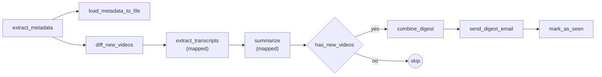

#  Transcript Intelligence

> A daily Apache Airflow pipeline that watches a YouTube channel, reads the transcripts of new videos, summarizes them with Google Gemini, and emails you a clean newsletter digest.


Do you not have time to watch every video from the [Apache Airflow YouTube channel](https://www.youtube.com/@ApacheAirflow/videos)? This project watches the channel for you. Each day, it finds the new uploads and sends one email with the key points of each video.

---

## Features

- **Channel monitoring:** Gets the list of all videos on the channel with `yt-dlp`. It does not download the videos.
- **New-video detection:** Keeps a record of the videos it has seen in an Airflow Variable. Only new uploads go into the digest.
- **Transcript extraction:** Gets the full transcript of each new video with `youtube-transcript-api`.
- **AI summaries:** Sends each transcript to **Gemini 2.5 Flash**. Each summary has:
  1. A short summary
  2. Action items
  3. Tools, technologies, and companies that the video mentions
  4. Important decisions or opinions
- **Email digest:** Combines all summaries into one HTML newsletter and sends it with SMTP.
- **Parallel processing:** Uses Airflow dynamic task mapping. Each video is processed in its own task.
- **Reliable:** Each task has 2 retries with exponential backoff. If there are no new videos, the DAG does not send an email.

---

## How it works



| Task | What it does |
| --- | --- |
| `extract_metadata` | Gets the ID and title of each video on the channel. |
| `load_metadata_to_file` | Writes the video list to `include/apache_airflow_yt_metadata.json`. |
| `diff_new_videos` | Compares the list with the `yt_seen_video_ids` Variable and returns only the new videos. |
| `extract_transcripts` | Gets the transcript of each new video. |
| `summarize` | Sends each transcript to Gemini and gets a structured summary. |
| `has_new_videos` | Stops the DAG run if there are no new summaries. |
| `combine_digest` | Makes one HTML newsletter with a link to each video. |
| `send_digest_email` | Sends the newsletter to the recipient. |
| `mark_as_seen` | Adds the new video IDs to `yt_seen_video_ids`. |

> **First run:** On the first run, the DAG marks all current videos as "seen" and sends no email. After that, you get a digest only when there are new uploads.


## Getting started

### 1. Prerequisites

- [Docker](https://www.docker.com/)
- [Astro CLI](https://www.astronomer.io/docs/astro/cli/install-cli)
- A [Google Gemini API key](https://aistudio.google.com/apikey)
- An SMTP account to send email (for example, Gmail with an [app password](https://support.google.com/accounts/answer/185833))

### 2. Clone the repository

```bash
git clone <your-repo-url>
cd transcript_intelligence
```

### 3. Set your Gemini API key

Create a `.env` file in the project root:

```bash
GEMINI_API_KEY=your-gemini-api-key
```

> Always put your `.env` is in `.gitignore`. Do not commit your keys pls!

### 4. Start Airflow

```bash
astro dev start
```

When the containers are ready, open the Airflow UI at **http://localhost:8080**.

### 5. Configure the SMTP connection

In the Airflow UI, go to **Admin → Connections** and add or edit the `smtp_default` connection:

| Field | Example value |
| --- | --- |
| Connection Id | `smtp_default` |
| Connection Type | `SMTP` |
| Host | `smtp.gmail.com` |
| Port | `587` |
| Login | `you@gmail.com` |
| Password | your app password |
| Extra | `{"from_email": "you@gmail.com"}` |

### 6. Set the recipient

Go to **Admin → Variables** and add:

| Key | Value |
| --- | --- |
| `digest_recipient_email` | The email address that gets the digest |

> You can also put connections and variables in `airflow_settings.yaml` for local development. This file is also in `.gitignore`.

### 7. Run the DAG

1. Find the `summarize_transcript` DAG in the UI and turn it on.
2. The DAG runs one time each day (`@daily`). You can also start it manually with **Trigger DAG**.

> **Test tip:** To get a digest immediately, edit the `yt_seen_video_ids` Variable and remove one or two video IDs. Then trigger the DAG.

---

## Customization

| Change | Where |
| --- | --- |
| Watch a different channel | `channel_url` in `extract_metadata` |
| Change the summary format | `prompt` in `summarize` |
| Use a different Gemini model | `model=` in `summarize` |
| Change the schedule | `schedule=` in the `@dag` decorator |
| Change the email subject or layout | `combine_digest` and `send_digest_email` |

---

## Tests

Run the DAG tests with:

```bash
astro dev pytest
```

---

